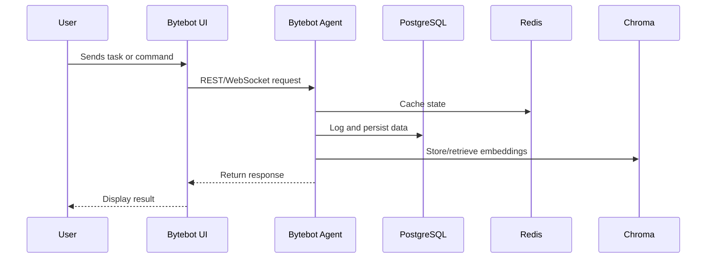

# Code-Buddy (Bytebot System)

> **AI-powered automation platform for secure remote desktop control and task management.**  
> This README includes live Mermaid diagrams and links to system documentation.

---

## 🧭 System Overview

```mermaid
%%{init: {'theme': 'neutral'}}%%
graph TD
    subgraph Bytebot Environment
        UI[Bytebot UI (9992)]
        Agent[Bytebot Agent (9991)]
        Desktop[Bytebot Desktop (9990)]
        DB[(PostgreSQL 5432)]
        Redis[(Redis 6379)]
        Chroma[(Chroma Vector DB 8001)]
        Exporter[(Redis Exporter 9121)]
    end

    UI --> Agent
    Agent --> Desktop
    Agent --> DB
    Agent --> Redis
    Agent --> Chroma
    Redis --> Exporter
```

The **UI** accepts user interactions and forwards requests to the **Agent**, which coordinates between services and databases.  
Persistent data resides in **PostgreSQL**, cache and pub/sub events in **Redis**, and AI memory vectors in **Chroma**.

---

## 📊 Data Flow



---

## ⚙️ Active Services

| Service | Description | Port |
|----------|--------------|------|
| `bytebot-ui` | Web dashboard and chat interface | 9992 |
| `bytebot-agent` | Core backend orchestrator | 9991 |
| `bytebot-desktop` | Local supervisor & control interface | 9990 |
| `bytebot-postgres` | Persistent data storage | 5432 |
| `infra-redis-1` | In-memory cache & pub/sub | 6379 |
| `infra-chroma-1` | Vector DB for embeddings | 8001 |
| `infra-redis-exporter-1` | Redis metrics for Prometheus | 9121 |

---

## 🖥️ Remote Access Guide

To access your local Bytebot Desktop safely:

```bash
ssh -L 9990:localhost:9990 sysop@<your_public_ip>
```

Or via browser (LAN only):  
👉 [http://192.168.1.104:9990](http://192.168.1.104:9990)

---

## 📂 Documentation Links

- [Architecture](docs/architecture.md)
- [Data Flow](docs/dataflow.md)
- [Operations Map](docs/ops-map.md)
- [Remote Desktop Guide](docs/remote-desktop-guide.md)

---

## 🧠 About

Code-Buddy / Bytebot integrates AI, automation, and desktop orchestration to deliver an extendable local AI control hub.  
The system is modular, Docker-based, and designed for offline or hybrid AI operations.

